# 01-06-第一个Flask程序

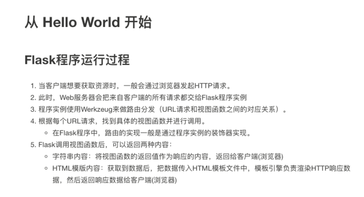

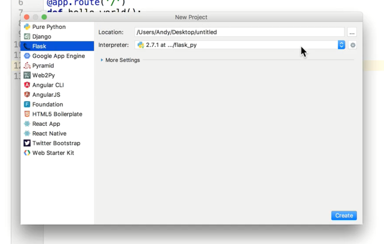

新建项目选择flask模板，默认生成最简单的python程序

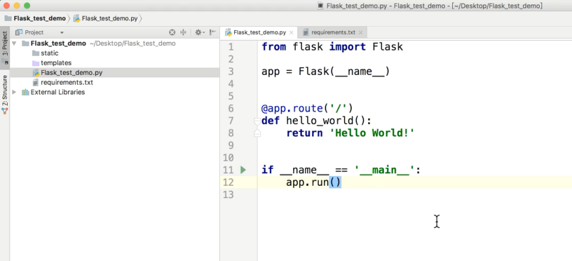

勾选运行就可以跑起来了

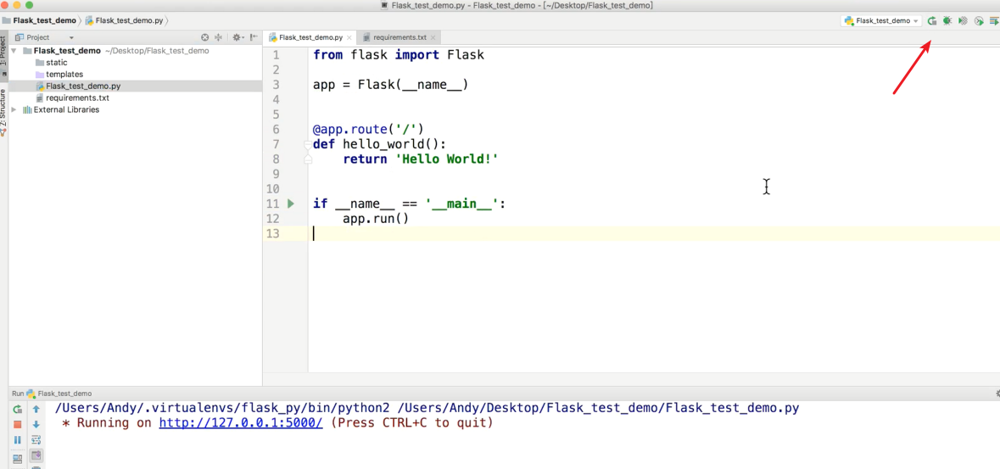

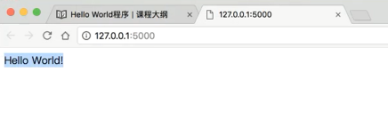

Python2中文显示会有问题，需要文件开头添加编码格式

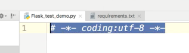

## 第一个Flask程序

* 导入flask扩展
* 创建flask应用程序实例
* 定义路由及视图函数
* 启动程序

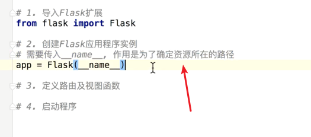

资源所在路径？

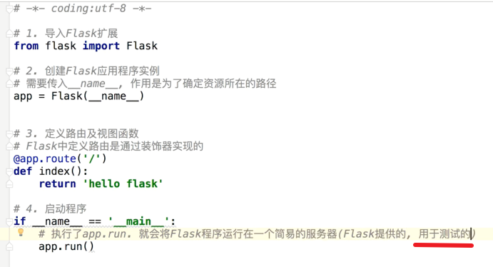

## python装饰器

作用于某一类函数共同可使用，省去函数调用
。相当于定义每一个路由一个处理函数

## 视图包括返回字符串以及模板，大部分用模板

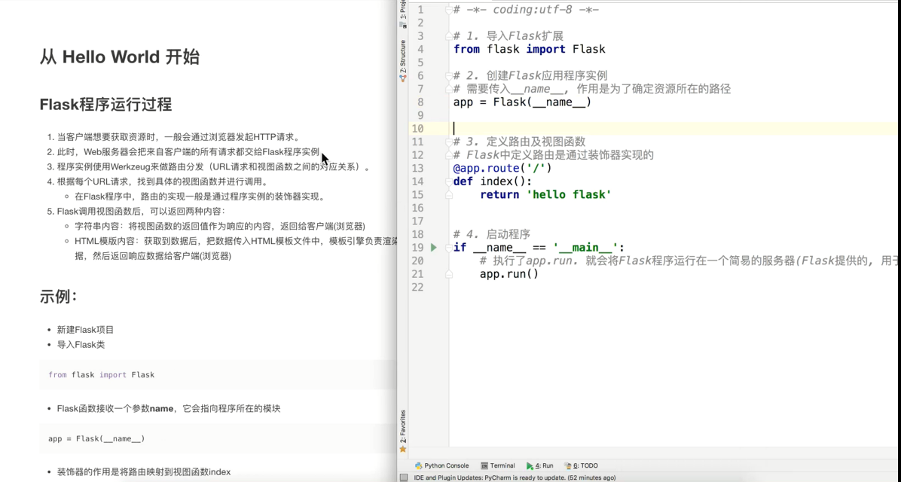

## flask返回html模板

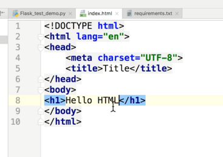

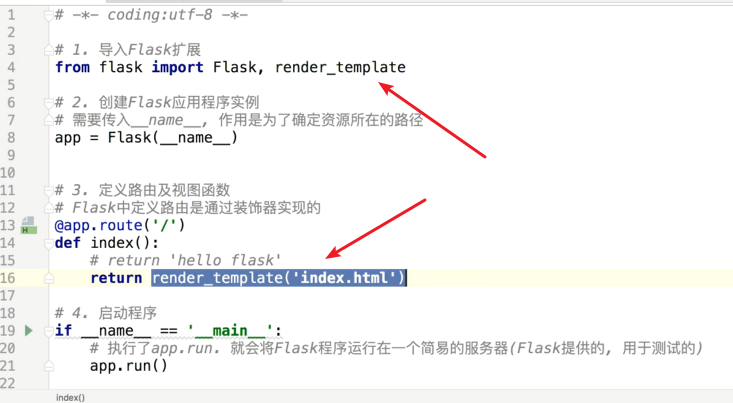

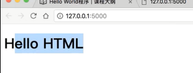

---
