# 会员注册-会员中心页面搭建

## 会员注册页面搭建

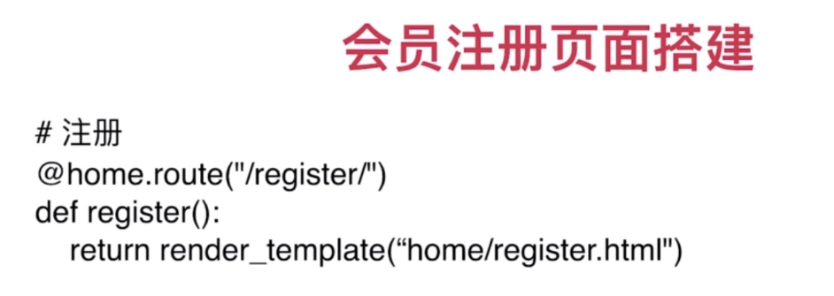

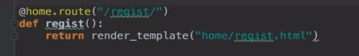

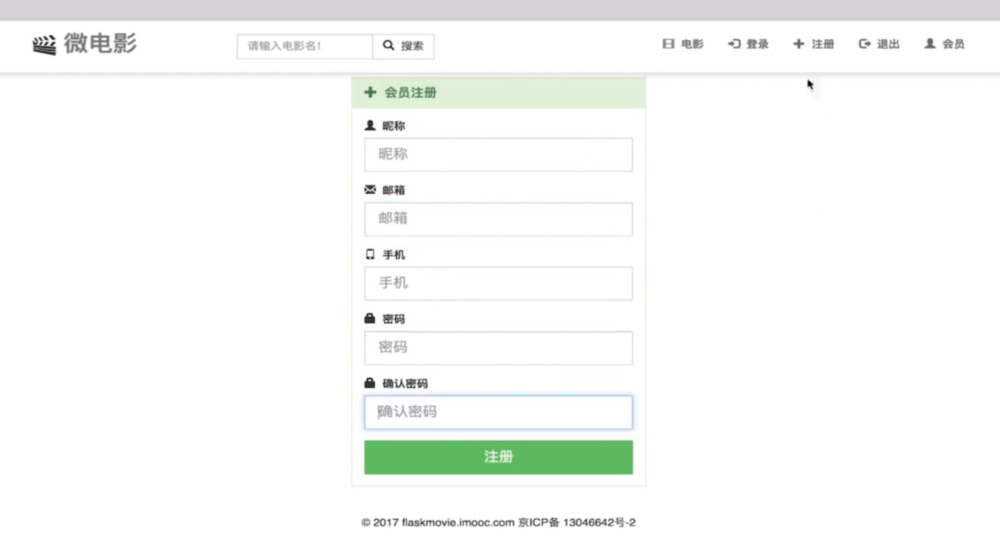

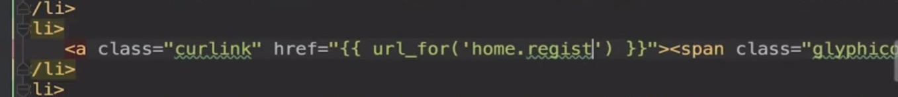

## 会员中心页面搭建

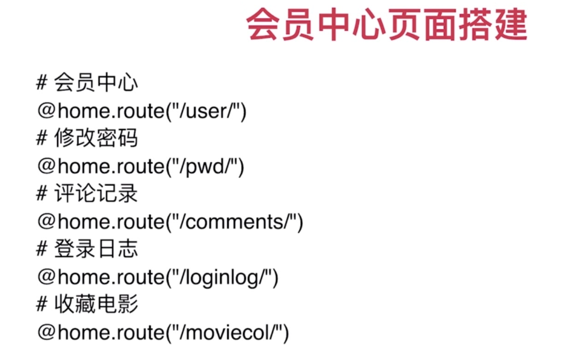

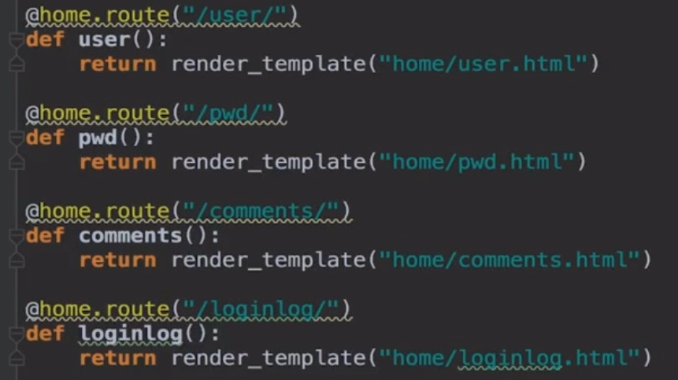

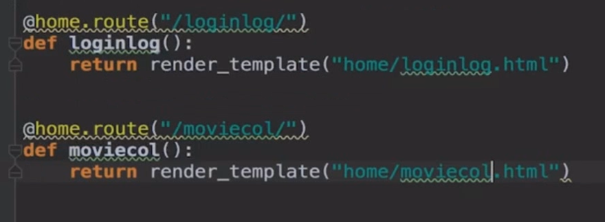

* 首先定义路由，然后创建视图。分别创建

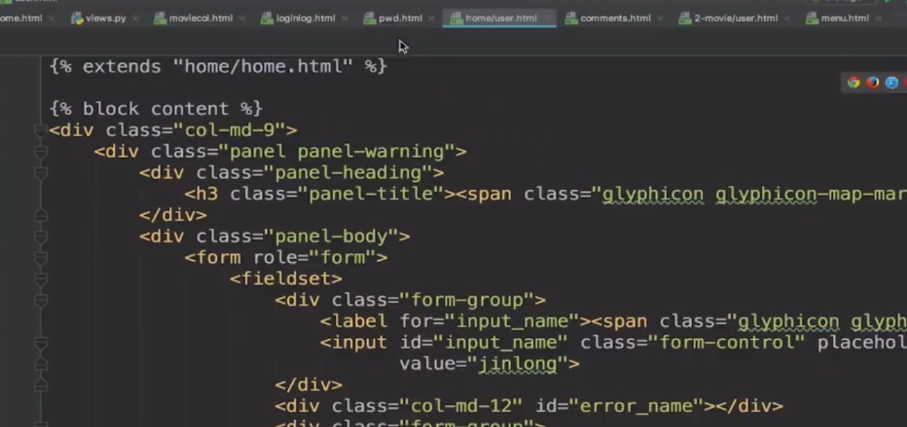

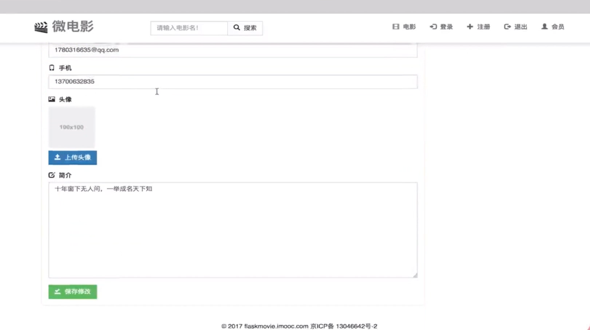

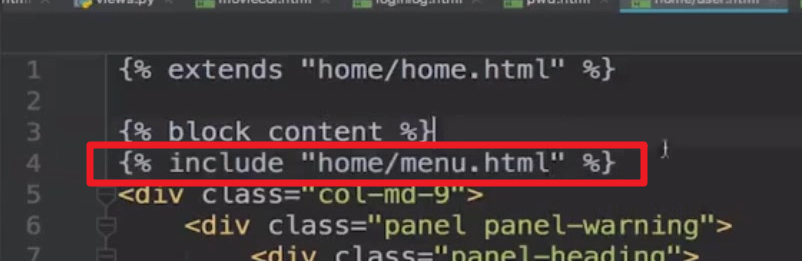

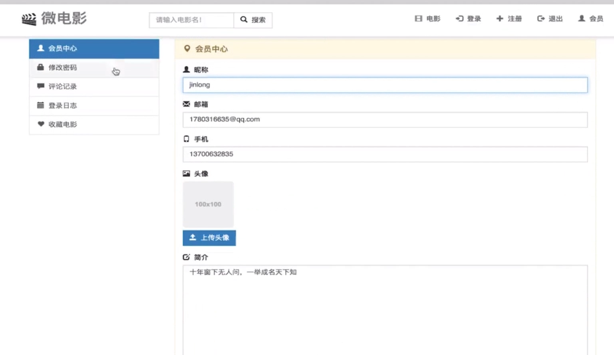

* 包含会员中心视图

* 如何添加css?

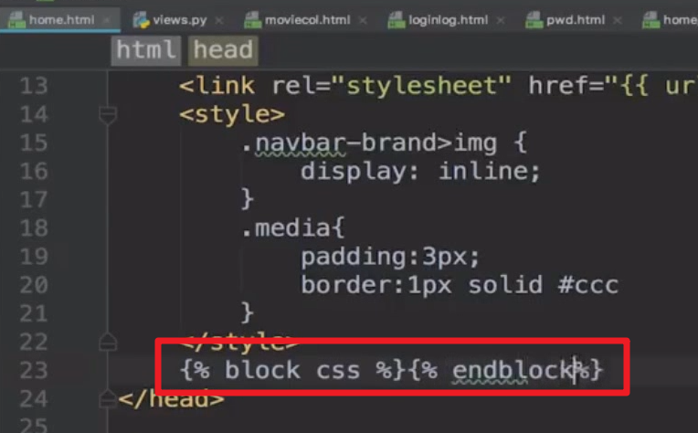

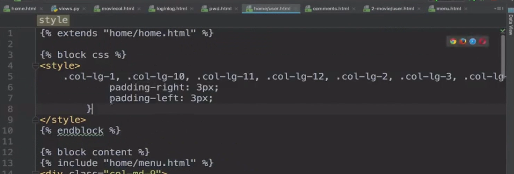

因为用的都是home.html模板，但是某个页面增加了样式，样式一般放在头部，因此定义一个block，类型为css即可

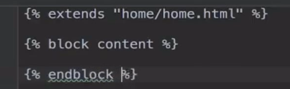

* 这里新增了一个menu.html，但是这个仅仅会员视图有，其他页面不一定有。

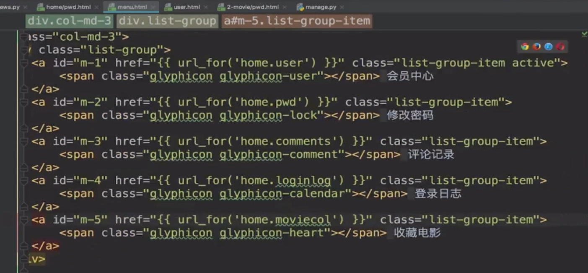

但是menu.html，需要设定激活，相当于选中哪个menu项

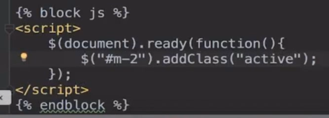

* 每个菜单项对应的页面都要通过js设定激活

---
